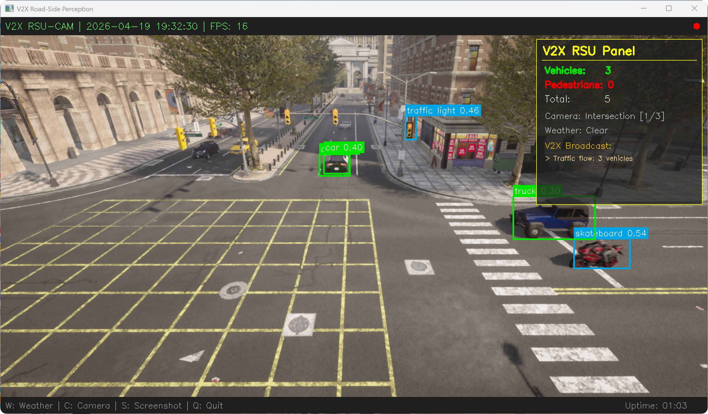
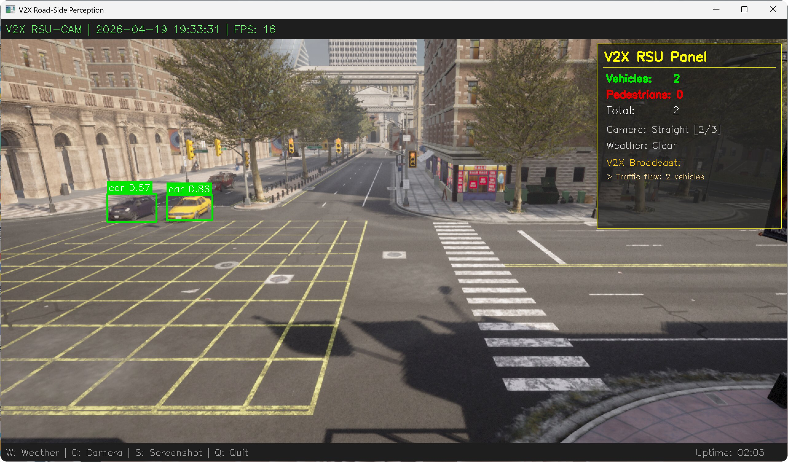
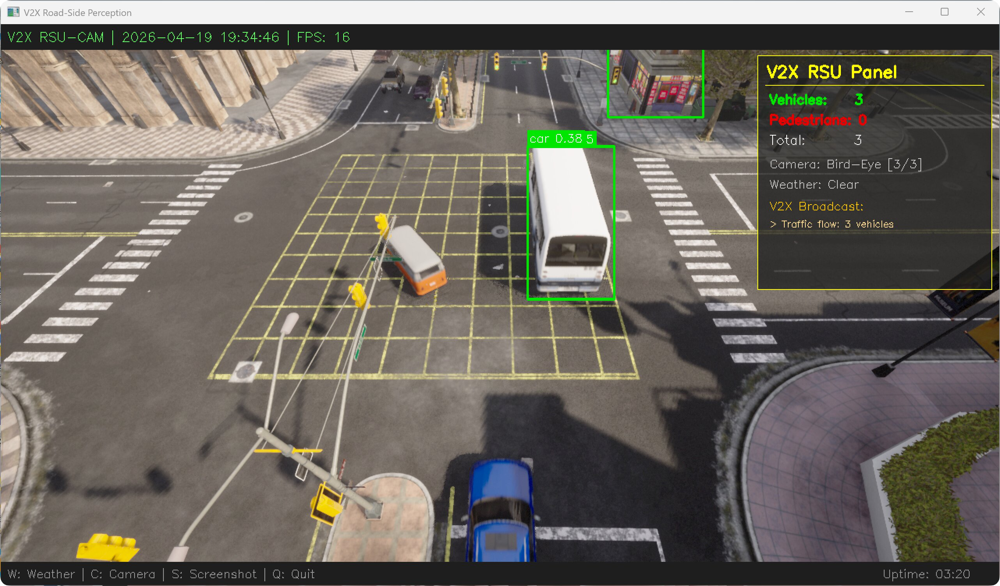
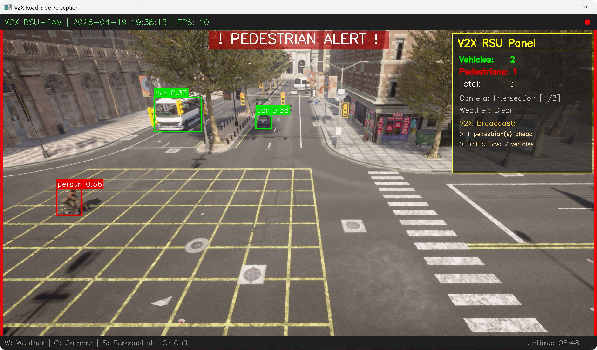
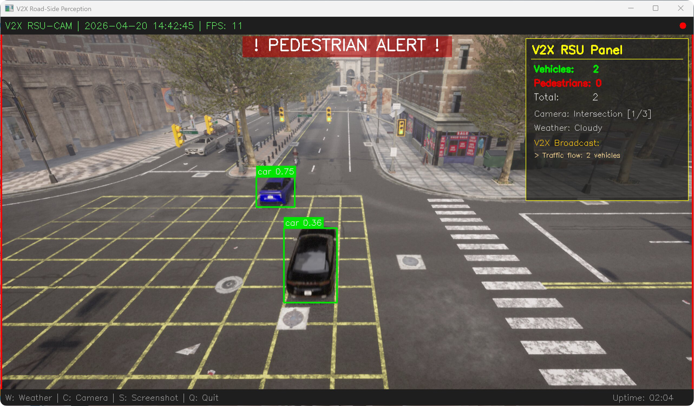
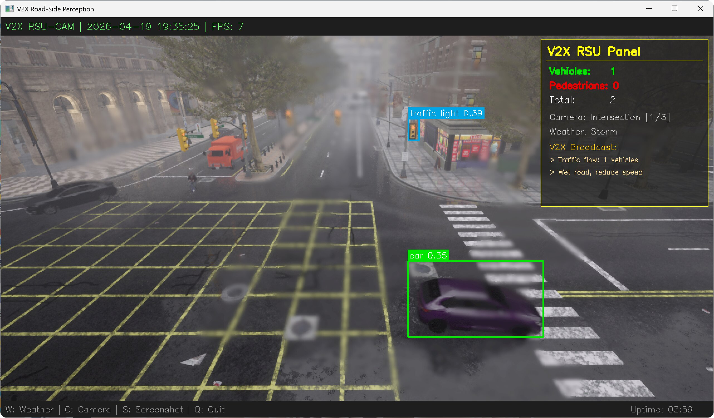
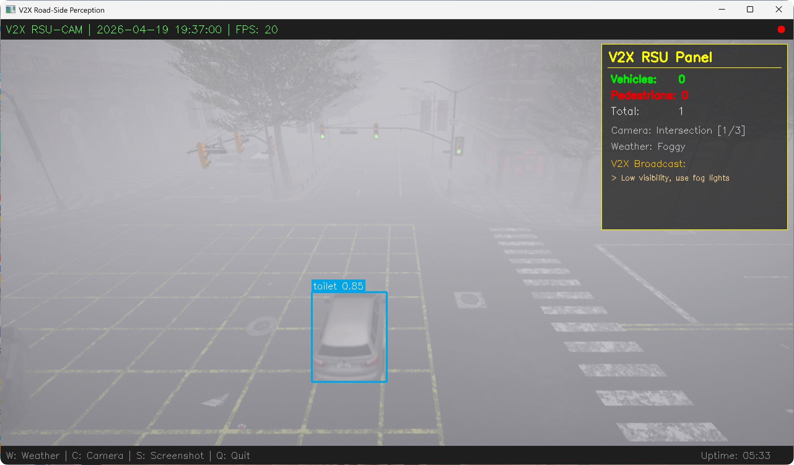
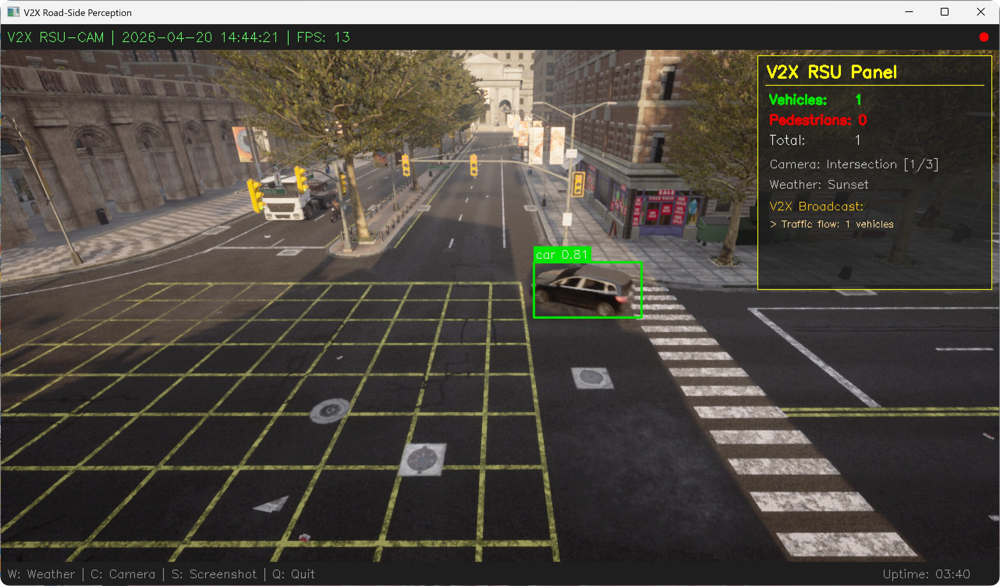
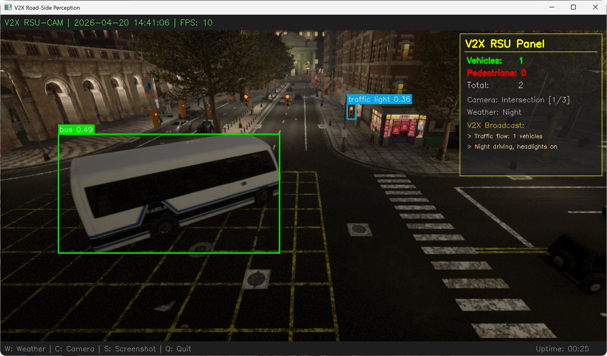

# 基于 YOLOv8n 的 V2X 路侧智能感知系统优化与实现

## 1. 项目背景与优化动机

### 1.1 功能定位

V2X（Vehicle-to-Everything）路侧感知是智能交通系统的核心基础设施之一，`edge_intelligence_V2X` 模块作为路侧边缘计算节点的感知组件，承担着 **"实时检测道路上的车辆与行人、生成交通态势信息、通过 V2X 通信向周围车辆广播预警消息"** 的关键职责，直接影响交通安全与通行效率。

本次优化的 `edge_intelligence_V2X` 模块，来自 OpenHUTB/nn 开源项目，面向智慧交通、车路协同、自动驾驶仿真等应用场景。

#### 1.1.1 模块在整个系统中的位置

在 V2X 车路协同技术栈中，本模块属于路侧感知层的核心视觉任务：

- **上游**：路侧摄像头视频流采集（CARLA 仿真器模拟）
- **本模块**：目标检测（车辆/行人/交通标志）、态势分析、预警生成
- **下游**：V2X 消息广播、交通信号控制、车辆路径规划、交通管理平台

路侧感知是车路协同的 "眼睛"，是实现超视距感知、盲区预警、交通态势共享的第一步。

#### 1.1.2 路侧感知的核心任务

`edge_intelligence_V2X` 模块主要完成以下关键工作：

1. **目标检测** — 从路侧摄像头画面中实时检测车辆、行人、交通标志等目标，输出类别、位置、置信度
2. **交通态势分析** — 统计当前路段的车辆密度、行人数量，判断交通拥堵程度
3. **V2X 预警广播** — 根据检测结果和天气条件，生成预警消息（行人闯入、交通拥堵、恶劣天气提醒等）
4. **多场景适应** — 支持不同天气（晴/雨/雾/夜）和不同摄像头视角下的稳定检测

#### 1.1.3 应用场景与重要性

- **智慧路口**：路侧感知单元实时监测路口交通状况，向接近车辆推送预警信息
- **车路协同**：弥补单车感知盲区，提供超视距感知能力，提升交通安全
- **自动驾驶仿真**：在 CARLA 仿真环境中验证 V2X 感知算法的有效性
- **交通管理**：实时监测车流量与行人密度，辅助交通信号优化与调度

#### 1.1.4 原模块设计缺陷

原项目更偏向概念演示与原型验证，在工程可运行性、版本兼容性和结果一致性方面仍有较大优化空间。

### 1.2 优化动机

在实际测试中，原 `edge_intelligence_V2X` 模块主要有三方面可提升点：

**检测逻辑由演示模式升级为模型推理模式**

原代码使用 `sin/cos` 数学函数模拟检测结果（`simulate_detection()`），检测框位置随时间做周期运动。本次将其升级为 YOLOv8n 的真实目标检测推理流程。

```python
# 原始代码 v2xEdgeYolov7Light2.py 中的假检测（已废弃）
def simulate_detection(image):
    """模拟检测框（随画面动态刷新）"""
    h, w = image.shape[:2]
    t = time.time() % 10
    offset_x = int(np.sin(t) * 10)
    offset_y = int(np.cos(t) * 5)
    boxes = [
        [w//4 + offset_x, h//4 + offset_y, w//3 + offset_x, h//3 + offset_y],
        [w//2 - offset_x, h//2 - offset_y, w//1.5 - offset_x, h//1.5 - offset_y],
    ]
    return np.array(boxes)
```

**主程序依赖需要工程化梳理**

原 `src/main.py` 依赖 `tools.pygame_display` 和 `tools.plotter_x`，在当前仓库结构下缺少对应模块，运行时会出现 `ImportError`，因此本次采用独立入口文件重构运行链路：

```python
# 原始 src/main.py 中缺失的依赖导入
from tools.pygame_display import PygameDisplay   # 模块不存在
from tools.plotter_x import Plotter              # 模块不存在
```

**环境版本需要统一到当前实验环境**

原代码硬编码了 CARLA 0.9.10 的 `.egg` 路径，本次统一适配到当前使用的 CARLA 0.9.16 环境：

```python
# 原始代码中硬编码的旧版路径
CARLA_EGG_PATH = r"D:\WindowsNoEditor\PythonAPI\carla\dist\carla-0.9.10-py3.7-win-amd64.egg"
```

基于以上改进点，本次优化的核心目标是：**将原型化演示版本升级为可运行、可复现实验结果的 V2X 路侧感知系统。**


## 2. 核心技术栈与理论基础

### 2.1 核心技术栈

| 技术 / 工具 | 用途 |
|---|---|
| Python 3.12 | 核心开发语言 |
| CARLA 0.9.16 | 自动驾驶仿真平台，提供真实感渲染的交通场景 |
| YOLOv8n (Ultralytics) | 轻量级实时目标检测模型，COCO 80 类预训练 |
| OpenCV 4.x | 图像处理、检测框绘制、视频显示、截图保存 |
| NumPy | 图像数据转换与数值计算 |

### 2.2 核心理论基础

#### 2.2.1 系统整体流程

```
CARLA 仿真场景 → 路侧摄像头采集 → YOLOv8n 目标检测 → 分类统计 → V2X 态势分析 → 预警消息生成 → HUD 面板可视化显示
```

#### 2.2.2 关键技术原理

**YOLOv8n 实时目标检测**

YOLOv8 是 Ultralytics 推出的最新一代 YOLO 系列模型。本项目采用 YOLOv8n（nano 版本），具有以下特点：

- 参数量仅 3.2M，推理速度快，适合边缘部署场景
- 在 COCO 数据集上预训练，可直接检测 80 类常见目标
- 本项目重点关注：`car`、`truck`、`bus`、`motorcycle`、`bicycle`（车辆类）和 `person`（行人类）

$$
\text{Detection} = \text{YOLO}(I_{frame}) \rightarrow \{(x_1, y_1, x_2, y_2, \text{class}, \text{conf})\}
$$

**隔帧检测策略**

为提升系统帧率，采用隔帧检测：每 $N$ 帧运行一次 YOLO 推理，中间帧复用上一次检测结果：

$$
D_t =
\begin{cases}
\mathrm{YOLO}(I_t), & t \bmod N = 0 \\
D_{t-1}, & \mathrm{otherwise}
\end{cases}
$$

其中 $N = 2$。在当前测试环境下可观察到帧率提升，具体增益会随硬件性能、交通密度和天气场景变化。

**V2X 路侧单元 (RSU) 信息融合**

路侧单元综合检测结果与环境信息，生成多类 V2X 预警广播：

| 触发条件 | 预警类型 | 广播消息 |
|---|---|---|
| 检测到行人 | 行人预警 | `Pedestrian(s) ahead` |
| 车辆数 > 5 | 交通拥堵 | `Heavy traffic: N vehicles` |
| 雨天/暴风天气 | 路面预警 | `Wet road, reduce speed` |
| 大雾天气 | 能见度预警 | `Low visibility, use fog lights` |
| 夜间场景 | 照明提醒 | `Night driving, headlights on` |


## 3. 优化整体思路

本次改进围绕运行稳定性、结果可观测性和实验复现性展开，对原有运行链路进行了整理，并将演示型检测流程替换为基于模型推理的实现。

### 3.1 优化总体原则

- 使用 YOLOv8n 预训练模型替换原有演示型检测逻辑
- 保持轻量化实现，避免引入额外训练流程和复杂依赖
- 简化运行入口，降低环境配置和复现实验的成本
- 保留必要的可视化与交互功能，便于演示、观察和调试

### 3.2 整体技术路线

| 层次 | 原版本问题 | 优化方案 |
|---|---|---|
| 检测引擎 | 演示型模拟框输出 | YOLOv8n 真实推理 |
| 运行环境 | 依赖链路不完整 | 全新 main.py，形成独立可运行入口 |
| CARLA 版本 | 硬编码 0.9.10 | 适配 0.9.16，同步模式 |
| 摄像头 | 无 | 路侧高处部署，3 种机位可切换 |
| 交通场景 | 交通参与者较少 | 60 辆车 + 30 个行人，优先近处生成 |
| 天气支持 | 无 | 7 种天气预设可切换 |
| V2X 面板 | 无 | 实时统计 + 预警广播 + 监控风格 HUD |
| 安全预警 | 无 | 行人闯入红色边框闪烁报警 |


## 4. 针对性优化方案与实现

### 4.1 检测引擎：从假检测到真实 YOLOv8n 推理

**改进点：** 原代码采用演示型模拟框逻辑，本次切换为基于 YOLOv8n 的真实推理流程。

**解决方案：** 引入 YOLOv8n 预训练模型，对每一帧进行真实的目标检测推理。

```python
def _load_model(self):
    """加载 YOLOv8n 预训练模型（COCO 80类，自动下载）"""
    self.model = YOLO('yolov8n.pt')

def _detect(self, frame):
    """YOLOv8 前向推理（隔帧检测提升帧率）"""
    self.tick_count += 1
    if self.tick_count % DETECT_INTERVAL == 0 or self.last_detections is None:
        results = self.model(frame, verbose=False, conf=YOLO_CONFIDENCE)
        self.last_detections = results[0]
    return self.last_detections
```

检测结果按 V2X 关注的类别分类统计：

```python
VEHICLE_CLASSES = {'car', 'truck', 'bus', 'motorcycle', 'bicycle'}
PERSON_CLASSES = {'person'}
```

每个检测目标用彩色检测框标注：绿色=车辆，红色=行人，橙色=其他。

### 4.2 多摄像头机位切换

**设计目标：** 模拟真实路侧感知部署中的多角度监控需求。

系统预设了 3 种摄像头机位，按 `C` 键可实时切换：

| 机位 | 高度 | 俯仰角 | FOV | 适用场景 |
|---|---|---|---|---|
| Intersection（路口） | 8m | -25° | 100° | 路口车辆/行人监控 |
| Straight（直道） | 6m | -15° | 90° | 直线道路车流监测 |
| Bird-Eye（鸟瞰） | 14m | -50° | 110° | 全局交通态势俯瞰 |

```python
CAMERA_POSITIONS = [
    {"name": "Intersection", "fwd": 8.0,  "right": 5.0, "z": 8.0,  "pitch": -25.0, "fov": 100},
    {"name": "Straight",     "fwd": 0.0,  "right": 8.0, "z": 6.0,  "pitch": -15.0, "fov": 90},
    {"name": "Bird-Eye",     "fwd": 0.0,  "right": 0.0, "z": 14.0, "pitch": -50.0, "fov": 110},
]
```

切换时自动销毁旧摄像头、创建新摄像头，并同步 CARLA 观察者视角：

```python
def _switch_camera_position(self, first_time=False):
    if self.camera and self.camera.is_alive:
        self.camera.stop()
        self.camera.destroy()
    pos = CAMERA_POSITIONS[self.cam_index]
    # ... 创建新摄像头并注册回调 ...
```

**路口机位（Intersection）：** 监控路口车辆通行



**直道机位（Straight）：** 侧方监测直线车流



**鸟瞰机位（Bird-Eye）：** 俯瞰全局交通态势



### 4.3 行人闯入安全报警

**设计目标：** V2X 路侧感知的核心安全功能——当检测到行人时，立即向驾驶员发出视觉警报。

当检测到行人时，系统触发持续 1.5 秒的红色报警效果：

- 画面边框红色闪烁（频率 4Hz）
- 画面顶部显示居中的 `! PEDESTRIAN ALERT !` 警告文字
- V2X 面板同步广播行人预警消息

```python
def _draw_pedestrian_alert(self, frame):
    if time.time() < self.ped_alert_timer:
        thickness = 8 if int(time.time() * 4) % 2 == 0 else 4
        cv2.rectangle(frame, (0, 0), (CAMERA_WIDTH - 1, CAMERA_HEIGHT - 1),
                      (0, 0, 255), thickness)
        # ... 绘制警告文字 ...
```



### 4.4 多天气场景支持

系统内置 7 种天气预设，按 `W` 键循环切换，V2X 面板自动生成对应的天气预警广播：

| 天气 | 特点 | V2X 预警 |
|---|---|---|
| Clear（晴天） | 能见度好 | 无特殊预警 |
| Cloudy（多云） | 光线偏暗 | 无特殊预警 |
| Rainy（雨天） | 路面湿滑 | `Wet road, reduce speed` |
| Storm（暴风雨） | 大雨+强风 | `Wet road, reduce speed` |
| Foggy（大雾） | 能见度极低 | `Low visibility, use fog lights` |
| Sunset（黄昏） | 逆光干扰 | 无特殊预警 |
| Night（夜晚） | 光照不足 | `Night driving, headlights on` |

**多云天气：**



**暴风雨天气：**



**大雾天气：**



**黄昏场景：**



**夜晚场景：**



### 4.5 NPC 交通流优化

**改进目标：** 提高画面中的交通参与者密度，增强可观察性与演示稳定性。

**优化方案：** 生成 60 辆 NPC 车辆 + 30 个行人，且**按与摄像头的距离排序**，优先在摄像头附近的路点生成车辆，确保画面中有丰富的检测目标。

```python
def _spawn_traffic(self):
    # 按与摄像头的距离排序，优先在附近生成
    cam_loc = self.cam_ref_point.location
    spawn_points.sort(key=lambda sp: sp.location.distance(cam_loc))

    for i in range(min(NPC_VEHICLE_COUNT, len(spawn_points))):
        v = self.world.try_spawn_actor(bp, spawn_points[i])
        if v:
            v.set_autopilot(True, self.tm.get_port())
```

行人同样自动生成并设置 AI 控制器，随机行走于人行道和路口区域：

```python
walker = self.world.try_spawn_actor(bp, carla.Transform(loc))
if walker:
    ctrl = self.world.spawn_actor(controller_bp, carla.Transform(), walker)
    ctrl.start()
    ctrl.go_to_location(self.world.get_random_location_from_navigation())
    ctrl.set_max_speed(random.uniform(1.0, 2.5))
```

### 4.6 V2X RSU 信息面板

系统在画面右上角绘制半透明的 V2X 路侧单元信息面板，实时显示：

- 检测统计：车辆数、行人数、总目标数
- 当前摄像头机位和天气信息
- V2X 预警广播消息（根据检测结果和天气动态生成）

画面顶部为监控风格的标题栏，显示时间戳、FPS、录制指示灯；底部为操作提示栏和运行时长。

预警广播消息根据当前检测结果和天气条件动态生成：

```python
def _get_v2x_messages(self):
    msgs = []
    if self.stats['pedestrians'] > 0:
        msgs.append(f"> {self.stats['pedestrians']} pedestrian(s) ahead")
    if self.stats['vehicles'] > 5:
        msgs.append(f"> Heavy traffic: {self.stats['vehicles']} vehicles")

    weather_name = self.weather_presets[self.weather_index][0]
    if weather_name in ('Rainy', 'Storm'):
        msgs.append("> Wet road, reduce speed")
    elif weather_name == 'Foggy':
        msgs.append("> Low visibility, use fog lights")
    elif weather_name == 'Night':
        msgs.append("> Night driving, headlights on")
    return msgs if msgs else ["> All clear"]
```

V2X 面板效果可在下方运行 GIF 和天气截图中观察到。


## 5. 系统运行效果

### 5.1 运行环境

| 项目 | 配置 |
|---|---|
| 操作系统 | Windows 11 |
| Python | 3.12.0 |
| CARLA | 0.9.16 |
| ultralytics | 8.4.39 |
| opencv-python | 4.13.0.92 |

### 5.2 运行方式

```bash
# 1. 启动 CARLA 服务器
CarlaUE4.exe

# 2. 安装依赖
pip install carla opencv-python numpy ultralytics

# 3. 运行系统
cd src/edge_intelligence_V2X
python main.py
```

### 5.3 按键操作

| 按键 | 功能 |
|---|---|
| `W` | 切换天气场景（7 种循环） |
| `C` | 切换摄像头机位（路口→直道→鸟瞰） |
| `S` | 保存当前画面截图到 `results/` 目录 |
| `Q` / `ESC` | 退出系统 |

### 5.4 运行效果展示

以下 GIF 展示了系统在运行中的连续效果（机位切换、天气变化、检测框与面板联动）：


## 6. 功能扩展与未来规划

- **多路摄像头同时工作**：从单路切换扩展为多路画面拼接显示，实现路口全方位监控
- **目标追踪**：引入 DeepSORT / ByteTrack，对检测到的车辆和行人进行跨帧追踪，统计车流量和行人流量
- **在线学习与自适应**：实现在线微调机制，根据当前场景动态调整模型参数，提升检测效果
- **V2X 协议集成**：接入 SAE J2735 等 V2X 标准协议，实现仿真环境内的消息编码与解码，模拟真实车路协同通信


## 7. 总结

本次优化主要完成了以下几方面工作：

1. 将原有演示型检测逻辑替换为基于 YOLOv8n 的目标检测流程，并补充了类别统计与可视化标注。
2. 结合 CARLA 0.9.16 环境重新整理了运行入口，补充了多机位、多天气和交通参与者生成逻辑。
3. 增加了行人报警、V2X 面板和运行 GIF 展示，使实验结果更便于观察和说明。
4. 补充了依赖说明、运行方式和文档展示内容，便于在课程作业和演示场景中复现。

当前版本已经能够完成单路路侧摄像头场景下的目标检测、基础态势展示和简单预警信息生成，也为后续接入目标追踪、协议栈和多传感器融合预留了扩展空间。
