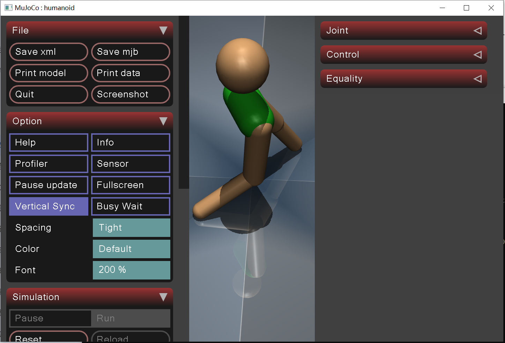

# USD-2023Z
Reinforcement learning with MuJoCo simulator. Requires Python version >= 3.8.

## Installation (Linux)
run
```bash
python -m venv ./venv
source venv/bin/activate
pip install -r requirements.txt
```
1. If using windows, it may be that you have to install Visuall C++ Tools lib from here https://visualstudio.microsoft.com/pl/visual-cpp-build-tools/
2. If Your CUDA driver version is different than >12.0, install torch by hand from https://pytorch.org/get-started/locally/

## Train
to Humanoid model with SAC agent 
```bash
python train.py
```

## Tests
```bash
python test.py --load-model trained_models/mujoco_trained
# or
python test.py --load-model trained_models/mujoco_trained --env-type pybullet
```
### Simulation Result (MuJoCo)

