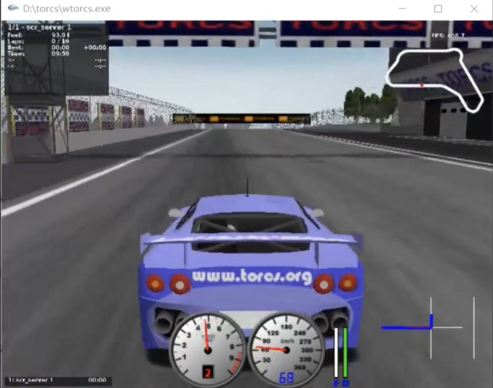

# TORCS 自动驾驶强化学习项目

## 项目概述
本项目基于 TORCS 模拟器，使用深度确定性策略梯度(DDPG)算法实现自动驾驶。智能体通过强化学习学习驾驶策略，能够在赛道上自主行驶。

本项目是对 https://github.com/jastfkjg/DDPG_Torcs_PyTorch.git 的复现，并针对实验中出现的问题对代码进行改进。

## 文件结构
```text
├── snakeoil3_gym.py       # TORCS客户端通信接口
├── gym_torcs.py           # OpenAI Gym环境封装
├── main.py                # DDPG算法主训练脚本
├── ActorNetwork.py        # Actor网络定义
├── CriticNetwork.py       # Critic网络定义
├── ReplayBuffer.py        # 经验回放缓冲区
├── OU.py                  # Ornstein-Uhlenbeck噪声过程
├── autostart.sh           # TORCS自动启动脚本
└── Runtime_Screenshot.jpg # 运行时截图
```

## 环境配置要求
* Python 3
* [gym_torcs](https://github.com/ugo-nama-kun/gym_torcs)
* PyTorch 0.4.1

## 运行方法
```
git clone https://github.com/jastfkjg/DDPG_Torcs_PyTorch.git
cd DDPG_Torcs_PyTorch
python main.py

```

## 项目运行截图
<p>
  
</p>